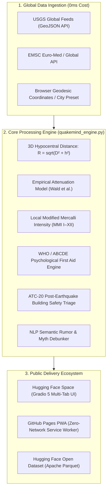

# 🌐 QuakeMind Global *(SismoMente Global)*

[](https://opensource.org/licenses/MIT)
[](https://www.python.org/)
[](https://huggingface.co/spaces)
[](https://earthquake.usgs.gov)
[](https://github.com/neurodeveloper11)
[](https://www.who.int)

> **Real-Time Global Seismic Intelligence, Human-Centric Psychological First Aid (PAP), and Zero-Network Emergency Survival Hub.**  
> *Conceived and engineered by **Fabio Ignacio Torres Benítez** (Psychologist, Cognitive Scientist & Data / AI Engineer).*  
> **100% Free, Open Source, and Accessible to Every Citizen Worldwide.**

---

## 🌍 The Global Problem: Why Earthquake Apps Fail Humans

Earthquakes affect over **2.8 billion people** across the globe, from the Pacific Ring of Fire (Japan, Indonesia, Chile, Colombia, Mexico, California) to the Alpine-Himalayan belt (Turkey, Greece, Italy, Iran).

While existing technological solutions (USGS, EMSC, JMA, Google Android Alerts) focus exclusively on **pure geophysics** (magnitude, depth, epicenter) or provide a 5-second preliminary alarm:

1. **The Human Panic Crisis:** The overwhelming majority of serious injuries and secondary fatalities during and immediately after shaking occur due to acute panic: stampedes down stairwells, jumping from windows, cardiac events, hyperventilation, and motor freezing.
2. **Infrastructure & Telecom Collapse:** In high-magnitude events, 4G/5G mobile networks saturate or fail completely within 120 seconds due to calling spikes and video traffic. Heavy applications fail to load.
3. **Misinformation Pandemics:** Viral hoaxes (*"A mega 9.0 earthquake has been predicted for 6:00 PM tonight"*) spread across messaging apps, terrorizing traumatized populations.
4. **Post-Shaking Cognitive Overload:** Regular citizens cannot decipher whether a crack in their wall is dangerous or cosmetic, nor do they know how to deliver **Psychological First Aid (PAP)** to a hysterical child or hyperventilating family member.

**QuakeMind Global bridges this divide.** It unites **Geophysical Data Science** with **Emergency Psychology & Cognitive Science**, offering a dual-layer ecosystem: an intelligent cloud Space and an ultra-resilient zero-network offline PWA.

---

## 🏗️ System Architecture



---

## ✨ Core Capabilities & Scientific Foundation

### 1. 📡 Live Global Seismic Monitor & Local Shaking Calculator
* **Multi-Source Ingestion:** Ingests live USGS feeds (`all_hour`, `day_all`, `4.5_day`, `significant_month`) with local cache fallback in case of connection dropouts.
* **Ground Motion Prediction Equations (GMPE):** Translates raw geophysical data ($M$, depth $h$, epicentral distance $D$) into the **hypocentral 3D slant distance** $R = \sqrt{D^2 + h^2}$ and calculates the estimated **Modified Mercalli Intensity (MMI I–XII)**:
  $$\text{MMI}_{\text{local}} \approx 1.5 \cdot M - 2.5 \cdot \log_{10}(R) + 1.2$$
* **Human-Centric Translation:** Instead of confusing numbers, it tells the citizen: *"At your location, shaking was felt as MMI IV (Light). Structural damage to modern buildings is statistically improbable. Breathe calmly."*

### 2. 🧠 Human-Centric Psychological First Aid (PAP)
* **Standardized Protocol:** Engineered under **WHO / PAHO guidelines** and the **ABCDE Crisis Intervention Model**:
  * **A (Active Grounding 5-4-3-2-1):** Deactivates dissociation, depersonalization, and panic tunnel vision.
  * **B (Breathing Retraining):** 4-4-7 Cyclic Sighing pacer designed to trigger parasympathetic vagal braking, stopping hyperventilation and tremors.
  * **C (Categorization of Needs):** Isolates actionable priorities: bleeding, gas leaks, structural stability.
  * **D (Support Networks):** Guidelines for responsible communication (single brief SMS instead of network-jamming calls/videos).
  * **E (Psychoeducation):** Normalizes acute stress responses (involuntary muscle shivering, vestibular "phantom quakes") as healthy biological adrenaline discharges.

### 3. 🏗️ ATC-20 Citizen Structural Safety Triage
* Aligned with the **Applied Technology Council (ATC-20)** and seismic building codes (**NSR-10** Colombia, **COVENIN** Venezuela, **FEMA** USA):
  * 🟢 **GREEN TAG (Inspected - Safe to Occupy):** Hairline/cosmetic cracks in plaster (< 1-2 mm).
  * 🟡 **YELLOW TAG (Restricted Use - Caution):** Horizontal masonry cracks (2-5 mm) or non-bearing wall distress.
  * 🔴 **RED TAG (Unsafe - Evacuate Immediately):** Diagonal 45° 'X' shear cracks crossing structural columns/beams, exposed buckled rebar, wall tilting, or gas leaks.

### 4. 🔊 Zero-Network Offline Survival PWA (GitHub Pages)
Operates with **0 bytes of internet connection** once saved to the device:
* **3,500 Hz Acoustic Rescue Beacon:** Uses the native browser **Web Audio API** to synthesize a pure, high-penetration 3,500 Hz tone pulsing standard Morse code SOS (`... --- ...`). This specific frequency matches the resonance of the human ear canal, allowing trapped or blackout victims to guide search and rescue teams **without shouting or vocal exhaustion**.
* **Visual Screen Strobe:** High-contrast alternating flashing beacon for night rescue.
* **Offline 72-Hour Survival Backpack:** Interactive checklist saved permanently in `localStorage`.
* **Emergency Family ID Card Generator:** Renders a high-resolution identification badge on an HTML5 `<canvas>` and exports to PNG directly on the phone without servers.

### 5. 🔍 NLP Seismic Myth-Buster & Rumor Debunker
* Rigorously debunks viral hoaxes using geophysics and statistics:
  * Deterministic time/hour predictions $\to$ Why tectonic friction nucleation is a chaotic non-linear process.
  * "Earthquake weather / Hot muggy air" $\to$ Atmospheric troposphere vs. lithospheric depth physics.
  * Animals sensing quakes $\to$ Sensory perception of high-frequency P-waves (seconds before) vs. fake hour-long forecasts.
  * "Triangle of life" $\to$ Why official agencies mandate **Drop, Cover, and Hold On**.

---

## 🚀 Quickstart & Local Installation

### Prerequisites
* Python 3.11 or higher
* Modern web browser (Chrome, Firefox, Safari, Edge)

### 1. Clone the Repository
```bash
git clone https://github.com/neurodeveloper11/quakemind-global.git
cd quakemind-global
```

### 2. Install Dependencies
```bash
pip install -r requirements.txt
```

### 3. Run Automated Unit Tests
```bash
pytest -v tests/test_quakemind.py
```
*(All 16 unit tests covering Haversine geophysics, attenuation formulas, PAP logic, and ATC-20 triage will execute and pass).*

### 4. Launch the Hugging Face Space App Locally
```bash
python app.py
```
Open your browser at `http://localhost:7860`.

### 5. Launch the Offline PWA Locally
Simply open `pwa/index.html` in any web browser or serve via Python:
```bash
cd pwa
python -m http.server 8080
```
Visit `http://localhost:8080` on your mobile phone or desktop, and select **"Add to Home Screen"** to enable 100% offline functionality.

---

## 📦 Hugging Face Open Dataset

The project includes an automated global seismic dataset builder:
```bash
python scripts/build_hf_dataset.py
```
Generates:
* `dataset/global_seismic_risk_catalog.parquet` (Ultra-compressed Apache Parquet)
* `dataset/global_seismic_risk_catalog.csv`

Variables included: `event_id`, `title`, `place`, `magnitude`, `magnitude_type`, `depth_km`, `depth_category`, `latitude`, `longitude`, `time_iso_utc`, `seismic_energy_joules`, `usgs_alert_level`, `felt_reports_count`, `usgs_mmi`, `tsunami_alert`.

---

## 🔬 Scientific & Bibliographical References

1. **Wald, D. J., Quitoriano, V., Heaton, T. H., & Kanamori, H. (1999).** *Relationships between Peak Ground Acceleration, Peak Ground Velocity, and Modified Mercalli Intensity in California.* Earthquake Spectra, 15(3), 557-564.
2. **Worden, C. B., Gerstenberger, M. C., Rhoades, D. A., & Wald, D. J. (2012).** *Probabilistic relationships between ground-motion parameters and Modified Mercalli Intensity in New Zealand.* Bulletin of the Seismological Society of America, 102(3), 893-921.
3. **World Health Organization (WHO), War Trauma Foundation & World Vision International (2011).** *Psychological first aid: Guide for field workers.* WHO, Geneva.
4. **Applied Technology Council (ATC-20).** *Procedures for Postearthquake Safety Evaluation of Buildings.* Redwood City, CA.
5. **Asociación Colombiana de Ingeniería Sísmica (AIS).** *Reglamento Colombiano de Construcción Sismo Resistente (NSR-10).*
6. **Huberman, A. D. et al. (2023).** *Brief structured respiration practices enhance mood and reduce physiological arousal.* Cell Reports Medicine, 4(1), 100895.

---

## 👤 Author & Lead Architect

**Fabio Ignacio Torres Benítez**  
*Data Engineer | Cognitive Scientist & Clinical/Organizational Psychologist | Full-Stack AI Developer*  
📍 Cali / Buenaventura, Colombia  
🔗 [LinkedIn](https://www.linkedin.com/in/fabio-torres-39364b258) | [GitHub](https://github.com/neurodeveloper11) | [Google Play (NeuroGym Live)](https://play.google.com/store/apps/details?id=com.t11.neurochess&hl=es_419)

---

## 📄 License
This project is licensed under the **MIT License** — free to use, modify, study, and distribute for humanitarian, educational, and commercial purposes worldwide.
